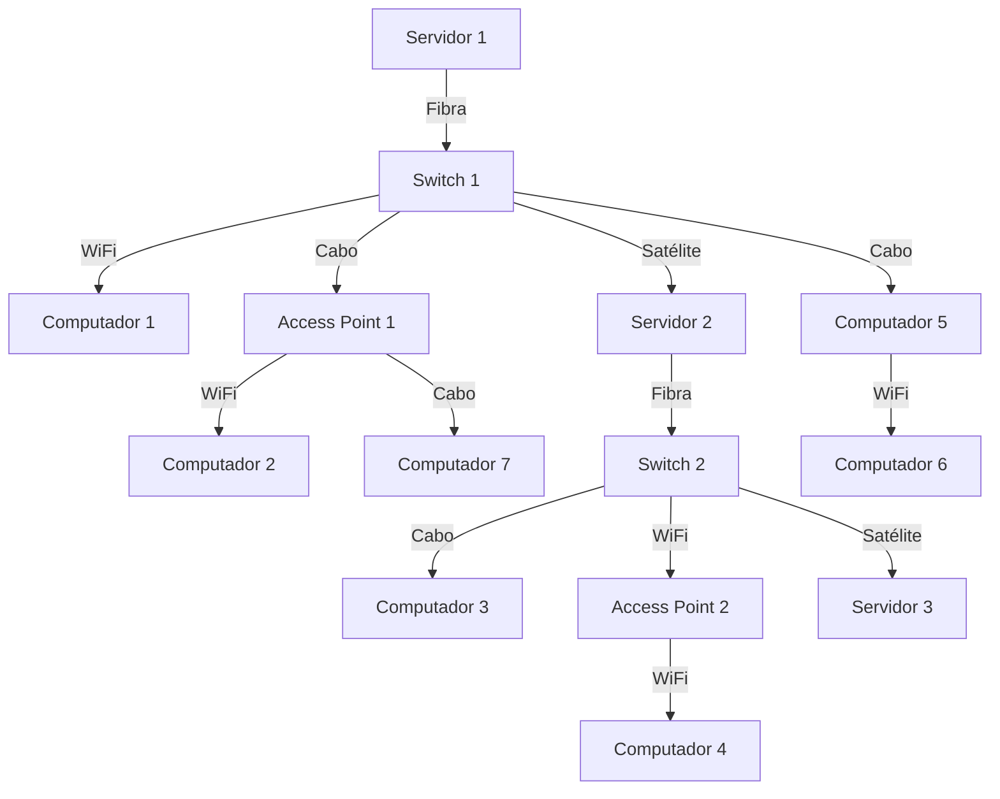

# Projeto final Estrutura de Dados

## Tema: **Rede de computadores**

- Grafo com topografia da rede
- Inserção de dispositivos com diferentes tipos de conexão
- Exibição do grafo com Mermaid
- Utilizar lista de Adjacência

### Tipo de grafo

- Grafo não orientado
- Valorado por tipo ( Satélite | wifi | Cabo | fibra )
- Vertices por tipo de dispositivo ( Servidor | Switch | Computador | Access Point )

### Restrições de Conexção

- Servidor só conecta com switch
- Computador conecta com switch e com Access Point
- Access Point só conecta com Switch

### Exemplo de mermaid

Neste exemplo:
- Cada nó representa um dispositivo na rede, podendo ser: Servidor, Switch, Computador ou Access Point.
- As setas representam conexões, rotuladas pelo tipo: WiFi, Cabo, Satélite, Fibra.
