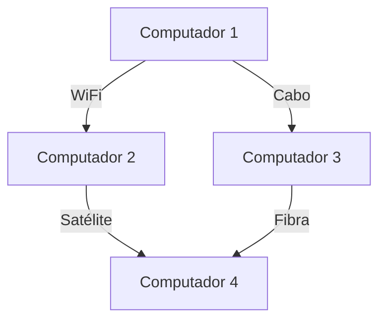

# Projeto final Estrutura de Dados

## Tema: **Rede de computadores**

- Grafo com topografia da rede
- Inserção de dispositivos com diferentes tipos de conexão
- Exibição do grafo com Mermaid
- Utilizar lista de Adjacência

- Grafo não orientado
- Valorado por tipo ( Satélite | wifi | Cabo | fibra )

## Exemplo de mermaid

Neste exemplo:
- Cada nó representa um dispositivo na rede.
- As setas representam conexões, rotuladas pelo tipo: WiFi, Cabo, Satélite, Fibra.
